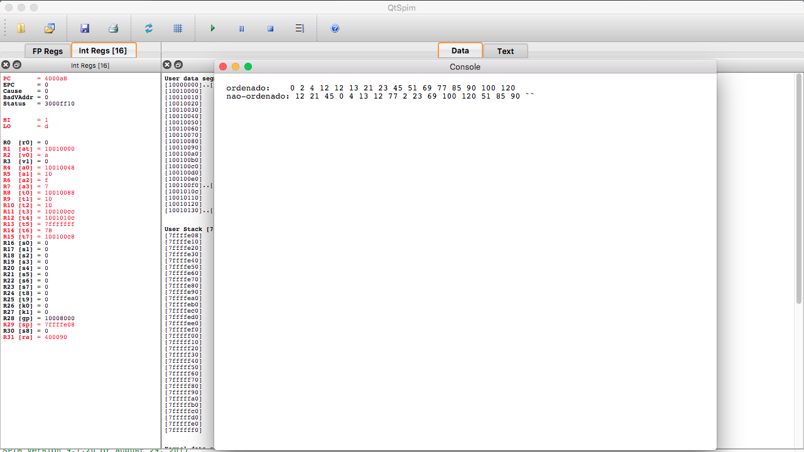

# Mergesort-mips

OVERVIEW
--------------------------------------------------
The purpose of this project was to implement a Mergesort algorithm in Assembly MIPS for the [Computer Organization and Architecture] course. It was made at the Computer Science undergraduate program from University of São Paulo (ICMC - USP).

PROJECT
--------------------------------------------------
Given an unsorted array of maximum size 16, sort it through mergesort algorithm.
If the array size is between 1 and 4, sort it through bubble sort algorithm.

The code has to be implemented in two kinds of assembly, therefore there will be two files:
* Assembly MIPS
* Assembly ICMC (Simplified Assembly Implementation for Academic Purposes)

EXAMPLE 
--------------------------------------------------

MIPS Version running through QTspim

HOW TO ASSEMBLE AND RUN
--------------------------------------------------
The following instructions are for the MIPS version 
```bash
	1. Install PCspim(Windows) or QTspim(Mac or Linux)
	2. Load the file
	3. Press the play button to run the program
```

MORE INFO
--------------------------------------------------
* Please check the file `project specification` to know more about this project.
* This code has been based on the C language mergesort algorithm which is in the file `merge_sort.c.zip`
